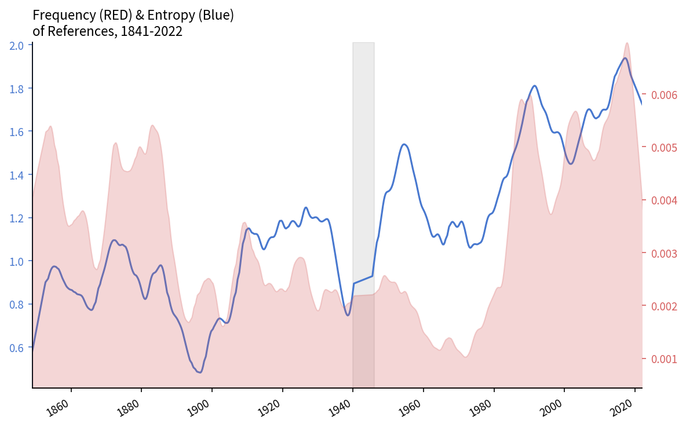
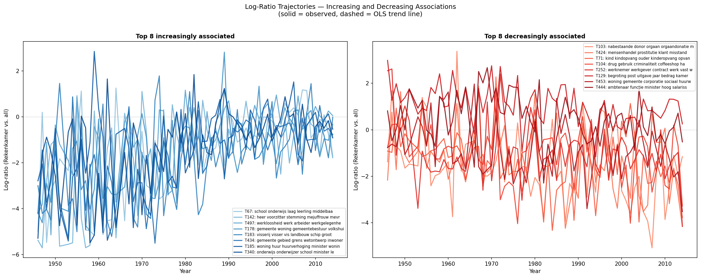
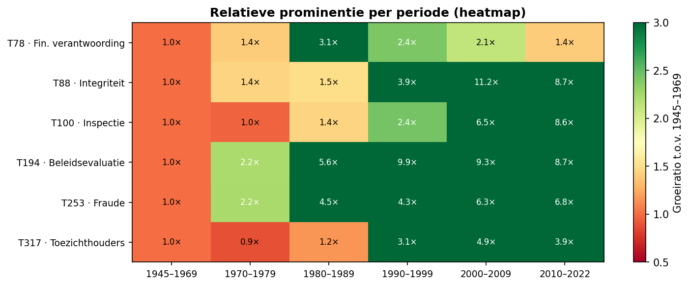

# Code for Visiting Scholarship at the Dutch Court of Audit

This repository contains the code used in the visiting scholarship at the Dutch Court of Audit. The goal of the scholarship was to develop new methods to study the Court's impact on politics and the public debate. The project culminated in three subprojects.

---

## Semantic footprints (`sentence-match/`)

Sentence embeddings are used to link individual sentences in Court of Audit reports to sentences in parliamentary debate, producing a dataset of fine-grained *references*. The matching pipeline covers the full digitised Handelingen from 1814 to 2022 and roughly 250 published audit reports. The resulting reference dataset drives both the topic and procedural analyses below.

---

## Referential sediments (`topic-analysis/`)

An LDA topic model (300 topics, 1972–2022) is used to compute quarterly partial correlations between topic prevalence and the volume of parliamentary references to the Court. Tracking these correlations over time reveals which policy domains have become more or less entangled with audit discourse — and which spikes are driven by the parliamentary calendar rather than the Court's own agenda.

---

## Procedural interactions (`kamervragen/`)

Parliamentary written questions (*kamervragen*) addressed to or mentioning the Court of Audit are extracted and annotated with a schema of question types (FEIT, CAU, OOR, ADV) using Claude via the Batches API. The annotated dataset is used to study how different parties and cabinets use the written-question instrument to interact with the Court, and how the Court's answers vary by question type.

---

## Data

Large raw data files (Handelingen corpus, audit report source files) are stored outside the repository at `~/Documents/Data/rekenkamer/` and are not tracked by git. Output CSVs and figures are committed under `results/`. See `topic-analysis/paths.py` and `kamervragen/paths.py` for path configuration; both respect the `REKENKAMER_DATA_DIR` and `REKENKAMER_LDA_DIR` environment variables.
